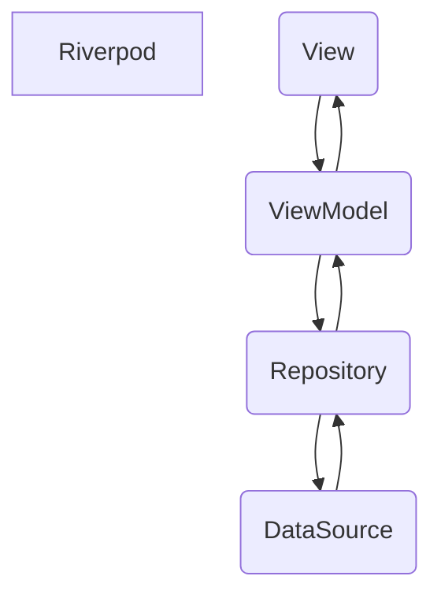
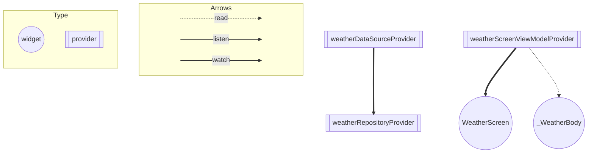

# ARCHITECTURE.md

# はじめに

- `ARCHITECTURE.md`
  を生成するにあたって、[Riverpod](https://riverpod.dev/)のproviderやwidgetの関係性を可視化をできるようにするために、`riverpod_graph`を使用しました。
- 以下の手順を踏むと自動ファイルが生成されます（今回の場合は、graph.mdに追記されます。）
- このプロジェクトではgraph.md自体のファイルは必ずしも残しておく必要はないと判断し、Commitせずに削除をしました。

## 手順

１、プロジェクトに移動

```
cd yumemi_training_app 
```

２、インストール（インストールしていない場合）

```
dart pub global activate -sgit https://github.com/rrousselGit/riverpod.git --git-path packages/riverpod_graph
```

３、生成する

```
dart pub global run riverpod_graph:riverpod_graph > graph.md
```

完成図としては、[Riverpod の Provider の依存関係図](https://github.com/iseruuuuu/flutter_yumemi_training_app/blob/main/ARCHITECTURE.md#riverpod-%E3%81%AE-provider-%E3%81%AE%E4%BE%9D%E5%AD%98%E9%96%A2%E4%BF%82%E5%9B%B3)となります。

## 参考サイト

- riverpod_graphのリポジトリ
    - https://github.com/rrousselGit/riverpod/tree/master/packages/riverpod_graph
- 日本語の記事
    - https://zenn.dev/noboru_i/articles/ea02828f33deaa

# 全体図



# アーキテクチャ

### View

- ViewModelから受け取ったデータを表示
- ユーザーが行ったアクションをViewModelに伝達

### ViewModel

- Repositoryからデータを取得
- 取得したデータの内容によって各種Providerを更新
- Viewの表示に関わるStateの管理
- Viewから受け取った操作（ボタンのタップ）Repositoryに対して天気のデータを取得or更新を伝える

### Repository

- DataSourceからデータを取得
- データをアプリで使いやすい形に変換
- エラーハンドリングを行う
- Result型に変換してViewModelに返す

### DataSource

- APIからデータを取得

## Riverpod の Provider の依存関係図



# ARCHITECTURE.md