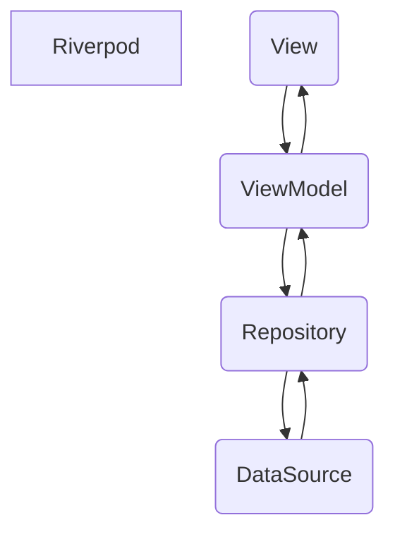
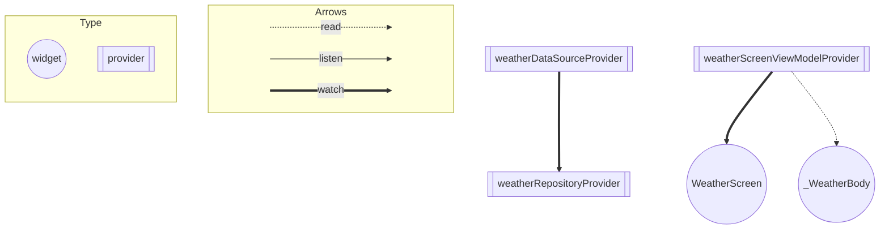

# ARCHITECTURE.md

# 全体図

# アーキテクチャ

### View

#### WeatherScreen
- 天気状態、最低・最高気温を管理している`weatherScreenViewModelProvider`をwatchして状態を更新するようにする。

#### _WeatherBody
- `weatherScreenViewModelProvider`をreadして、`reloadWeather`を呼ぶ。
  - 成功した(success)場合は、天気の情報を更新する。
  - 失敗した(failure)場合は、エラーのダイアログを表示する
### ViewModel

- Repositoryからデータを取得
- 取得したデータの内容によって各種Providerを更新
- Viewの表示に関わるStateの管理
- Viewから受け取った操作（ボタンのタップ）Repositoryに対して天気のデータを取得or更新を伝える

### Repository

- DataSourceからデータを取得
- データをアプリで使いやすい形に変換
- エラーハンドリングを行う
- Result型に変換してViewModelに返す

### DataSource

- APIからデータを取得

## Riverpod の Provider の依存関係図

# ARCHITECTURE.md