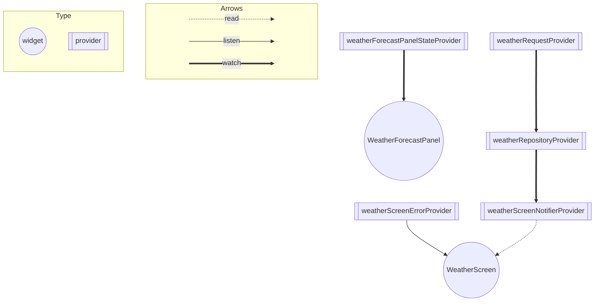

# Architecture

# View

### WeatherScreen 
・最低気温・最高気温の表示  　
・YumemiWeatherを呼ぶためのボタンの設置  　   　　
・画面遷移を戻るためのボタンの設置  　　

### WeatherForecastPanel
・天気の画像の表示  

# Notifier

### WeatherScreenNotifier
・WeatherRepositoryNotifierから取得した天気のデータを読み取り、Screenに表示させる  
・エラーの時のダイアログを出す。  
・画面を戻る処理を記載している  

### WeatherRepositoryNotifier
・YumemiWeatherAPIからデータを取得する。

# State

### WeatherScreenUiState
・天気の画像  
・最低気温  
・最高気温  