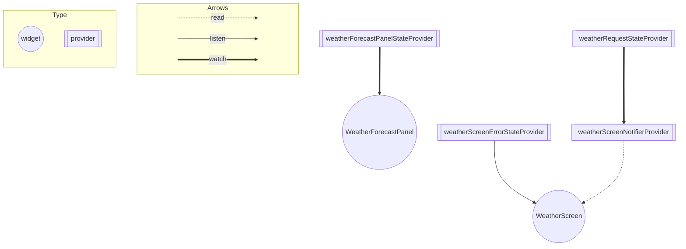

# Architecture

# View

### WeatherScreen
・YumemiWeatherを呼ぶためのボタンの設置       
・画面遷移を戻るためのボタンの設置  
・`WeatherForecastPanel`の設置  
・`WeatherScreenErrorState`をlistenしてエラー時にダイアログを出す。

### WeatherForecastPanel
・天気の画像の表示  
・最低気温・最高気温の表示

# Notifier

### WeatherScreenNotifierProvider
・天気の情報を取得する   
・YumemiWeatherAPIからデータを取得する。　　  
・取得できたデータを`WeatherForecastPanelStateProvider`に渡す。  
・エラーの場合は、`WeatherScreenErrorState`にエラーの内容を渡す。

# State

### WeatherForecastPanelStateProvider
・天気の画像(weatherCondition)  
・最高気温(maxTemperature)    
・最低気温(minTemperature)

### WeatherScreenErrorProvider
・エラー時のエラーメッセージ(errorMessage)

### WeatherRequestProvider
・エリア（area）  
・日時（date）  

