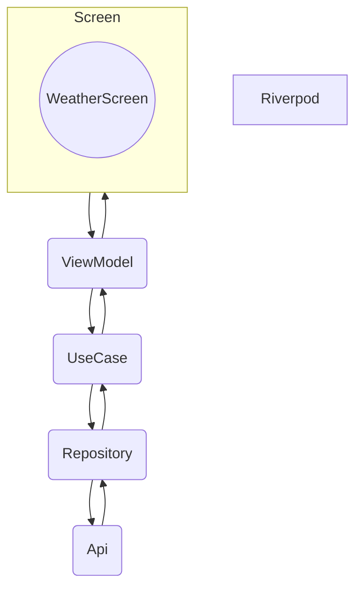
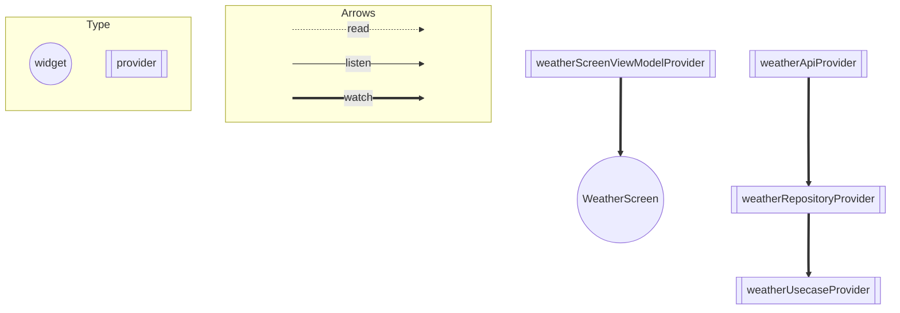

# ARCHITECTURE.md

# 全体図

# アーキテクチャ

### Screen
- 取得した天気情報の表示を行っている。
- エラーの際は、ダイアログを表示する。

### viewModel
- screenの表示に関わるStateの管理
- screenから受け取った操作（ボタンのタップ）Usecaseに対して天気のデータを取得or更新を伝える役割になっている。

### usecase
- 取得結果（成功か失敗か）をViewModelに伝える役割になっている。

### repository
- apiから取得したデータをアプリが使いやすい形に変換し、Usecaseに渡す役割になっている。

### api
- APIからデータを取得する
- fetchWeatherで取得したデータ（Weather）をUsecaseに渡してあげる。

##  Riverpod の Provider の依存関係図

# ARCHITECTURE.md
