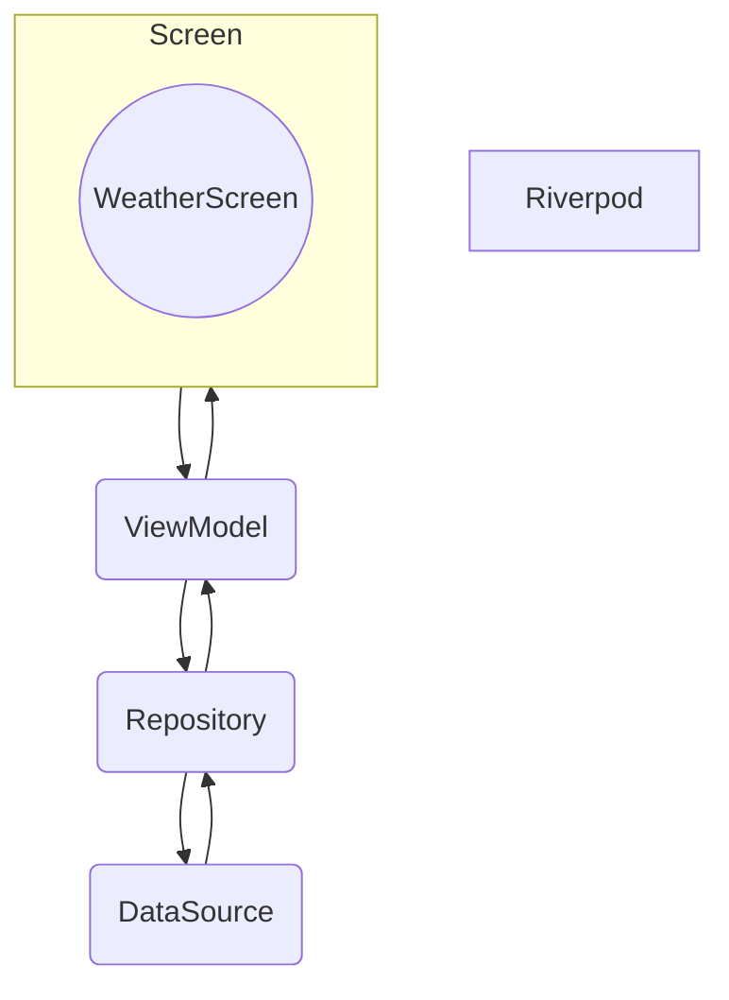
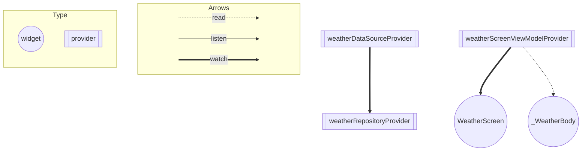

# ARCHITECTURE.md

# 全体図

# アーキテクチャ

### Screen

- 取得した天気情報の表示を行っている。
- エラーの際は、ダイアログを表示する。

### ViewModel

- Repositoryからデータを取得
- 取得したデータの内容によって各種Providerを更新
- Screenの表示に関わるStateの管理
- Screenから受け取った操作（ボタンのタップ）Repositoryに対して天気のデータを取得or更新を伝える

### Repository

- DataSourceからデータを取得
- データをアプリで使いやすい形に変換
- エラーハンドリングを行う
- Result型に変換してViewModelに返す

### DataSource

- APIからデータを取得

## Riverpod の Provider の依存関係図

# ARCHITECTURE.md